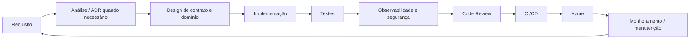

# 00 — Mapa do Handbook

## Fluxo de engenharia

## Capítulos

| Capítulo | Assunto |
|---|---|
| 01 | Princípios, severidade e regras |
| 02 | Arquitetura Backend |
| 03 | Português do Brasil e convenções |
| 04 | REST, HTTP e OpenAPI |
| 05 | Domain, Application e DI |
| 06 | Banco relacional |
| 07 | EF Core x Dapper |
| 08 | Azure e identidade |
| 09 | Dynamics / Dataverse |
| 10 | Azure Functions e Workers |
| 11 | Configuração, `.env`, appsettings e Key Vault |
| 12 | Segurança |
| 13 | Validação e Problem Details |
| 14 | Testes |
| 15 | Observabilidade |
| 16 | Resiliência e integração |
| 17 | Git Flow e commits |
| 18 | Code Review |
| 19 | CI/CD |
| 20 | Upgrade de APIs legadas |
| 21 | Performance |
| 22 | Checklist de produção |
| 23 | ADRs e governança |

## Regra para ferramentas de IA

Os arquivos Markdown são deliberadamente atômicos, com títulos previsíveis, regras explícitas e exemplos. Agentes devem recuperar apenas os capítulos necessários, mas sempre considerar `01`, `02` e `03` como regras-base.
