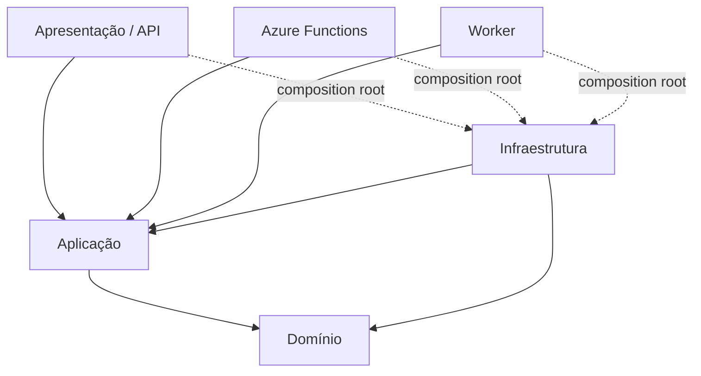

# 02 — Arquitetura Backend

## Padrão oficial

**Clean Architecture pragmática em camadas**, adequada para APIs e microserviços pequenos/médios.



## Solution recomendada

```text
Empresa.Produto.Servico.sln
src/
  Empresa.Produto.Servico.Api/
  Empresa.Produto.Servico.Aplicacao/
  Empresa.Produto.Servico.Dominio/
  Empresa.Produto.Servico.Infraestrutura/
  Empresa.Produto.Servico.Functions/      # quando necessário
  Empresa.Produto.Servico.Worker/         # quando necessário
tests/
  Empresa.Produto.Servico.Testes.Unitarios/
  Empresa.Produto.Servico.Testes.Integracao/
  Empresa.Produto.Servico.Testes.E2E/
```

## Responsabilidades

### Apresentação
HTTP, autenticação/autorização, model binding, status codes, OpenAPI. Não contém regra de negócio.

### Aplicação
Casos de uso, ports, orquestração, transações de aplicação, validações de workflow e contratos internos.

### Domínio
Entidades, Value Objects, invariantes, políticas e regras que não dependem de frameworks.

### Infraestrutura
SQL/EF/Dapper, Dataverse, Table Storage, Service Bus, Key Vault clients, integrações HTTP e implementações de ports.

## Dependências permitidas

```text
Api -> Aplicacao
Api -> Infraestrutura (somente registro/bootstrapping)
Aplicacao -> Dominio
Infraestrutura -> Aplicacao
Infraestrutura -> Dominio
Dominio -> nenhuma camada externa
```

## Microserviço não significa complexidade automática

CQRS, MediatR, Event Sourcing, Saga, Kafka/Service Bus, cache distribuído ou múltiplos bancos entram apenas por necessidade demonstrável e documentada.
