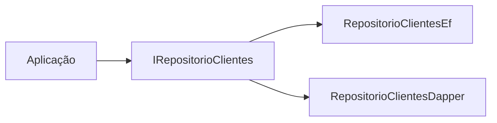

# 07 — Escolha entre Entity Framework Core e Dapper

Ambos são padrões suportados. A escolha deve constar no README/ADR quando impactar significativamente manutenção ou performance.

## EF Core — preferir quando

- domínio CRUD/relacional convencional;
- produtividade e migrations são prioridade;
- tracking e relacionamentos trazem valor;
- consultas LINQ permanecem compreensíveis;
- time precisa de convenções consistentes.

## Dapper — preferir quando

- SQL precisa ser explícito;
- leitura de alto volume/performance crítica;
- banco legado ou queries complexas;
- stored procedures fazem parte da integração;
- shape da query difere fortemente do modelo de domínio.

## Permitido: abordagem híbrida

EF Core para comandos e Dapper para leituras é permitido, mas **não é sinônimo de CQRS** e deve ser justificado.

## Regra arquitetural

Application não sabe qual tecnologia foi escolhida:

## EF Core

- `DbContext` Scoped.
- `AsNoTracking()` em leituras que não serão atualizadas.
- evitar N+1.
- projeção (`Select`) para DTO/read model quando apropriado.
- migrations revisadas como código.

## Dapper

- SQL parametrizado sempre.
- conexão aberta pelo menor tempo possível.
- query em arquivo/classe organizada; não espalhar SQL em controller/serviço.
- mapping explícito quando nomes divergem.
