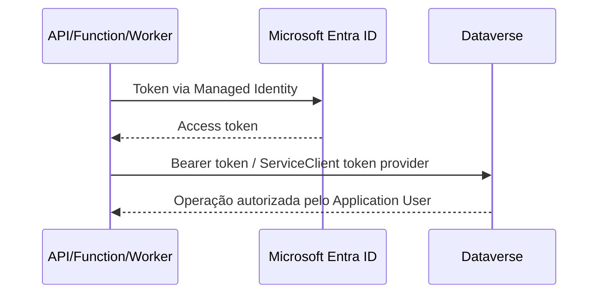

# 09 — Microsoft Dynamics 365 / Dataverse

## Regra de autenticação

Integrações server-to-server **não usam usuário e senha**. OAuth/Microsoft Entra ID é obrigatório.

## Preferência de produção

Quando a arquitetura/tenant suportar o fluxo, a workload Azure usa Managed Identity para obter token para o recurso Dataverse e se apresenta por um principal mapeado a um **Application User** no Dataverse, com security role mínima.



## Alternativa S2S

Quando Managed Identity não for viável no cenário específico, usar App Registration + Application User + certificado ou client secret. Em produção, certificado/credencial federada é preferível a segredo estático quando suportado.

## Exemplo com token provider

```csharp
var urlDataverse = new Uri(configuracao.UrlDataverse);
var credencial = new ManagedIdentityCredential();

async Task<string> ObterTokenAsync(string _)
{
    var contexto = new TokenRequestContext([$"{urlDataverse.GetLeftPart(UriPartial.Authority)}/.default"]);
    var token = await credencial.GetTokenAsync(contexto, CancellationToken.None);
    return token.Token;
}

var cliente = new ServiceClient(urlDataverse, ObterTokenAsync, useUniqueInstance: false);
```

> O provisionamento do Application User, security roles e compatibilidade do tenant deve ser validado com a equipe Power Platform. Não assumir que habilitar Managed Identity no App Service/Function concede automaticamente permissão no Dataverse.

## Design da integração

- Encapsular SDK/Web API em `IClienteDataverse` ou port orientado ao caso de uso.
- Não devolver `Entity`, `EntityReference` ou SDK types para Domain/Application.
- Aplicar retry apenas para erros transitórios e respeitar throttling/`Retry-After`.
- Preferir batch quando houver ganho e sem comprometer tratamento de falhas.
- Logar `correlationId`, operação e duração; nunca payload sensível integral.
