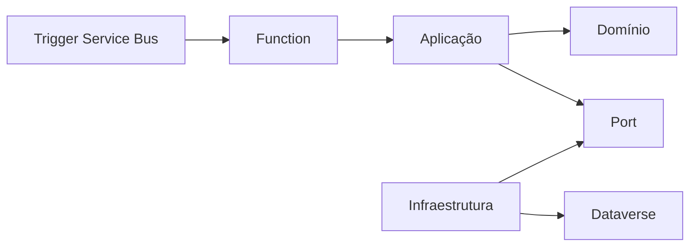

# 10 — Azure Functions e Workers

## Escolha

### Azure Function
Use para triggers/eventos, timers, Service Bus, Storage, HTTP específico e processamento serverless.

### Worker Service
Use para processo contínuo, consumidor de fila com controle próprio, polling inevitável ou execução hospedada em Container Apps/AKS/App Service.

## Isolamento

Functions e Workers são hosts. Reutilizam `Aplicacao` e `Infraestrutura`; regras não vivem no trigger.

## Functions

- preferir modelo isolated worker para .NET moderno;
- tratar idempotência para mensagens;
- não capturar exceção e retornar sucesso;
- configurar retry/DLQ conscientemente;
- correlation ID deve atravessar trigger e integrações.

## Workers

- respeitar `CancellationToken`/shutdown gracioso;
- não usar loop sem delay/backoff;
- readiness deve refletir dependências essenciais;
- definir concorrência e prefetch de mensageria com base em capacidade real.
