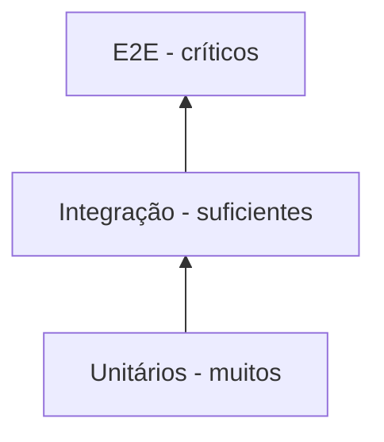

# 14 — Estratégia de Testes

## Pirâmide pragmática

## Unitários

- Domain: invariantes e transições sem mocks de entidade.
- Application: mocks/fakes apenas para ports externos.
- ferramentas sugeridas: xUnit, NSubstitute/Moq, FluentAssertions ou asserts nativos conforme padrão aprovado.

## Integração

Testar implementações reais de:

- repositórios EF/Dapper;
- mapping SQL;
- clientes HTTP quando possível com servidor fake/fixture;
- serialização e middleware.

Para SQL, preferir Testcontainers ou ambiente efêmero no pipeline quando política permitir.

## E2E

Subir o host com `WebApplicationFactory` e atravessar HTTP -> Application -> Infrastructure. Dependências externas caras devem usar ambiente de teste controlado ou simulador de contrato, sem transformar E2E em testes frágeis de terceiros.

## Functions/Workers

- testar handler/orquestração fora do trigger;
- integração do trigger deve ter teste específico;
- comportamento de retry/idempotência deve ser testado.

## Critério

Cobertura percentual não substitui casos relevantes. Exigir cobertura de regras críticas, erros e caminhos de integração.
