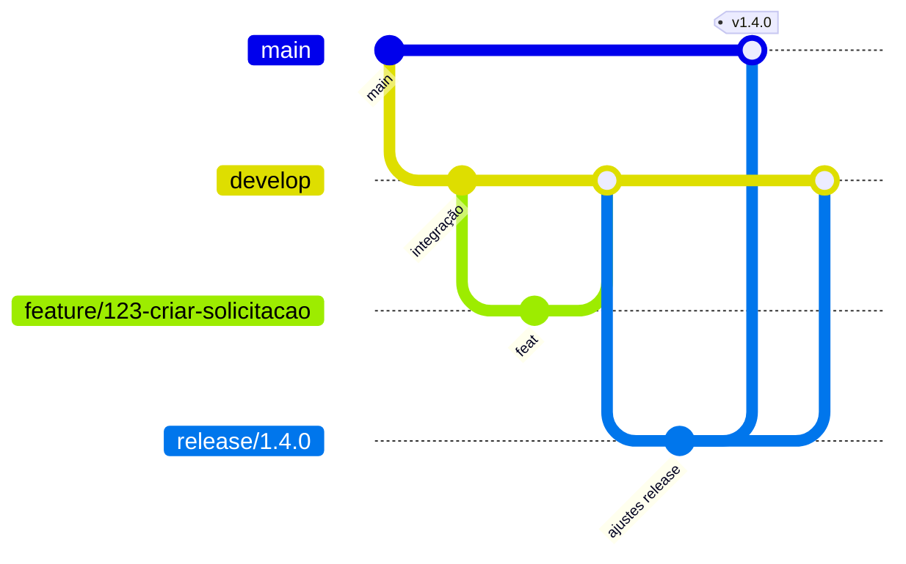
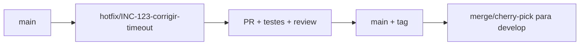

# 17 — Git Flow, Branches e Commits

## Modelo corporativo recomendado

Um **Git Flow simplificado**, compatível com entrega contínua.



## Branches

- `main` — produção; protegida; somente PR/release/hotfix.
- `develop` — integração, quando o produto realmente usa cadência Git Flow.
- `feature/<ticket>-<slug>` — desenvolvimento novo.
- `bugfix/<ticket>-<slug>` — correção não urgente antes de produção.
- `hotfix/<ticket>-<slug>` — correção urgente iniciada a partir de `main`.
- `release/<versao>` — estabilização, quando houver janela formal de release.
- `chore/...`, `docs/...`, `refactor/...` — manutenção técnica curta.

> Times com trunk-based delivery podem omitir `develop`/`release` mediante decisão registrada. Branches devem continuar curtas.

## Hotfix



## Commits

Usar Conventional Commits em PT-BR no texto:

```text
feat(solicitacoes): adiciona criação de solicitação
fix(dataverse): trata throttling 429
refactor(persistencia): extrai consulta para repositório
perf(clientes): reduz round-trips no SQL
security(auth): restringe audience aceita
chore(deps): atualiza pacotes aprovados
```

Commits devem ser pequenos, coerentes e compiláveis sempre que possível. Não usar “ajustes”, “fix”, “final” sem contexto.

## PR

Título objetivo, ticket, impacto, evidência de teste, risco, migração/configuração e observabilidade.
