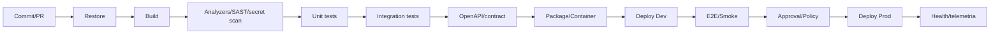

# 19 — CI/CD

## Pipeline mínimo

## Regras

- branch protection;
- build reproduzível;
- versões de pacote controladas;
- artefato promovido entre ambientes, evitando recompilar de forma diferente;
- secrets obtidos pelo pipeline via identidade/secret store;
- migrations com estratégia de compatibilidade/rollback;
- IaC para recursos Azure relevantes;
- deploy deve observar health e possibilitar rollback.

## Estratégias

Blue/green, canary e deployment slots são recomendados quando custo/criticidade justificarem.
