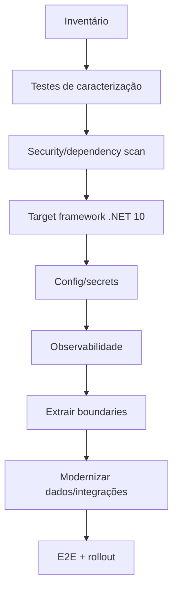

# 20 — Upgrade de APIs Legadas

## Regra principal

Modernização é incremental. Não reescrever um sistema estável apenas para deixá-lo “bonito”.

## Fluxo

## Inventário obrigatório

- target framework e pacotes;
- endpoints/consumidores;
- autenticação/autorização;
- SQL/ORM;
- Dynamics/Dataverse;
- jobs/Functions;
- secrets/config;
- telemetria;
- deploy/runtime;
- riscos e código morto.

## Ordem recomendada

1. estabilizar com testes de caracterização;
2. eliminar vulnerabilidades e pacotes incompatíveis;
3. migrar framework;
4. externalizar secrets;
5. substituir credenciais legadas por Entra/Managed Identity onde viável;
6. introduzir Problem Details/observabilidade;
7. refatorar boundaries por fatias verticais;
8. migrar EF/Dapper somente se houver valor concreto;
9. validar contrato e rollout.

## Strangler

Para sistemas grandes, novos endpoints/casos de uso podem nascer na arquitetura nova enquanto o legado é gradualmente encapsulado.
